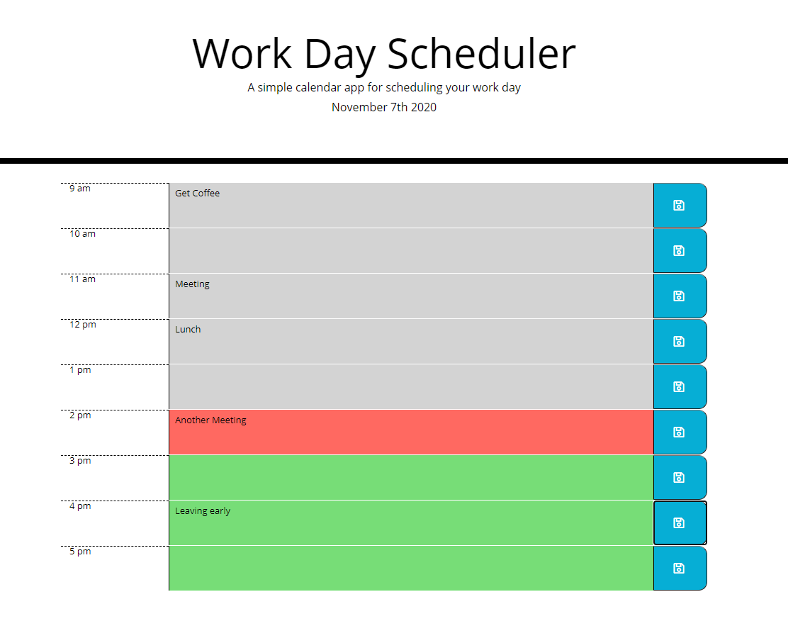
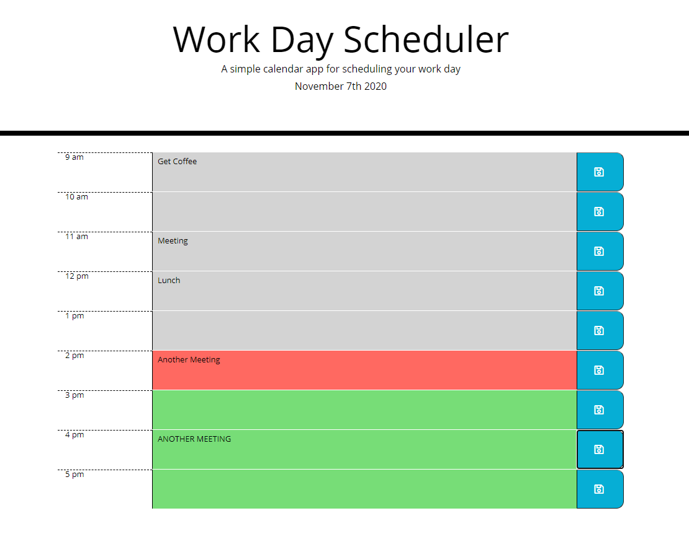

# 05 Third-Party APIs: Work Day Scheduler

## The Task

This is a simple calendar application that allows a user to save and update events for each hour of the day to help keep themselves organized.   The hours that have past will be grayed out, the current hour will be red, and all future hours will be green.

- Repository link: https://github.com/greysonkirk/CodeQuiz
- Web App link: https://greysonkirk.github.io/CodeQuiz

